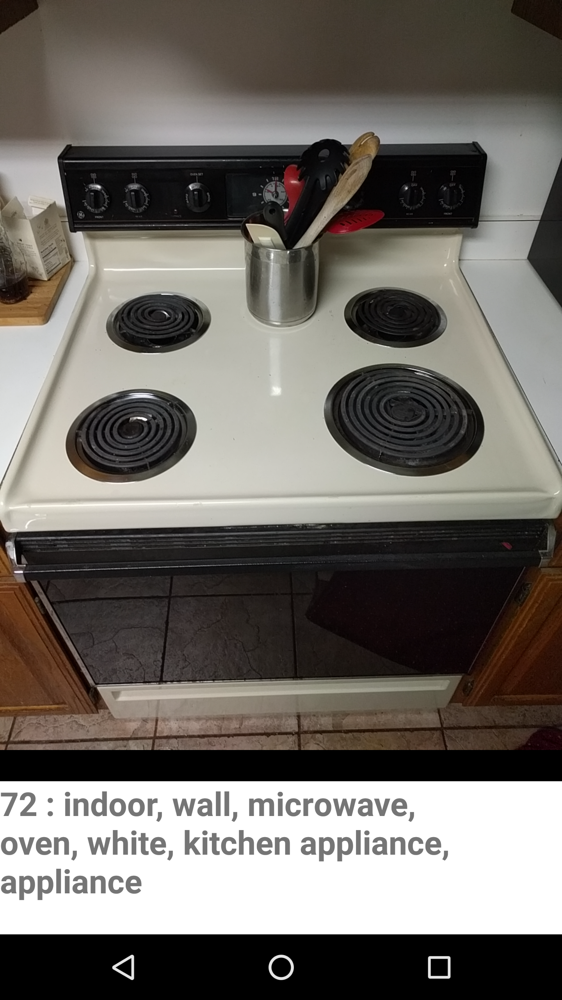
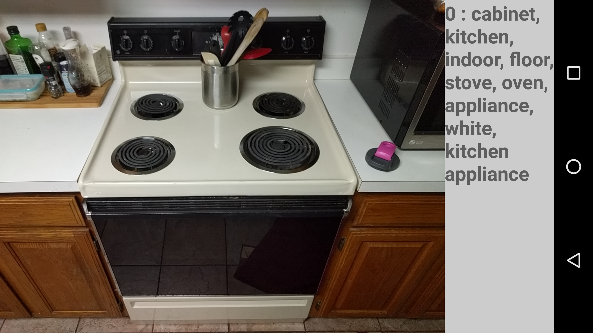

Live Azure Image Processing based on Android Camera2Basic Sample
===================================

This code displays slightly delayed information about the view of the phones rear camera.

Introduction
------------

Android camera2 sample code is used to setup a reliable preview. Each frame of the preview is grabbed by an ImageReader with an OnImageAvailableListener. Every 40th frame is processed from a YUV_420_888 to a JPEG Byte Array. In a new thread this Byte Array is sent in an HTTP request to Azure. The reply is then set as the value for a textView.

Multiple Azure requests are handled at the same time. The time a request takes is based on network upload speed. 

The percentage of frames that are ignored versus processed is managed by the pullXFrame variable in Camera2BasicFragment.java.

The speed of a request can be sped up or slowed down by changing the compressionQuality variable in the NV21toJPEG function in Camera2BasicFragment.java. Errors will occur if the images cannot be uploaded fast enough to keep up with the rate at which frames are sent. However, lower quality images reduce the quality of tags received. 

The variable azureSubscriptionKey in Camera2BasicFragment.java is the subscription key that is used. My key is currently there. The key has to match the server, the server for my key being eastus2.

App was tested on a Huawei Nexus 6P Android 7.1.1, API 25 physical device, and a Nexus 6P Android 7.1.1, API 25 virtual device.

A built APK is located at Application/Build/outputs/apk/Application-debug.apk

Pre-requisites
--------------

- Android SDK 25
- Android Build Tools v25.0.3
- Android Support Repository

Screenshots
-------------

Getting Started
---------------

This sample uses the Gradle build system. To build this project, use the
"gradlew build" command or use "Import Project" in Android Studio.

License
-------

Copyright 2017 The Android Open Source Project, Inc.

Licensed to the Apache Software Foundation (ASF) under one or more contributor
license agreements.  See the NOTICE file distributed with this work for
additional information regarding copyright ownership.  The ASF licenses this
file to you under the Apache License, Version 2.0 (the "License"); you may not
use this file except in compliance with the License.  You may obtain a copy of
the License at

http://www.apache.org/licenses/LICENSE-2.0

Unless required by applicable law or agreed to in writing, software
distributed under the License is distributed on an "AS IS" BASIS, WITHOUT
WARRANTIES OR CONDITIONS OF ANY KIND, either express or implied.  See the
License for the specific language governing permissions and limitations under
the License.
